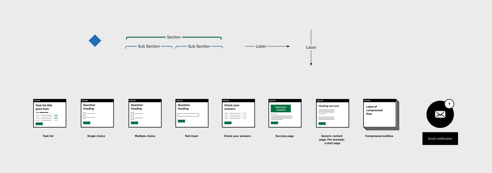
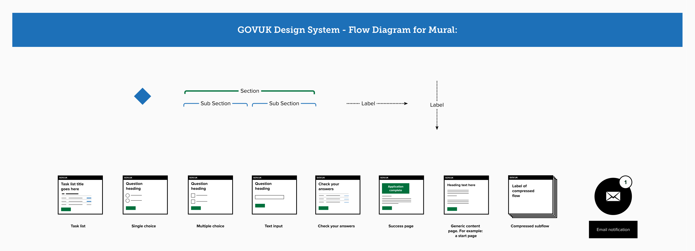

# GOVUK Design System Flow Diagrams for Mural
A [Mural version](https://app.mural.co/t/digitalhmrc9032/m/digitalhmrc9032/1660126757244/a18e7737b3a8c9b507dd02e5cafcb73e660ddaf5?sender=u88f21b544bf2ceb924a42629) of a popular [GOVUK Design System](https://gov.uk/design-system) based flow diagram developed by the GOVDESIGN community.

## If you use a free or paid Mural account

### Instructions to copy to your own Mural board

1. Create a new Mural board or open an existing board that you would like to add the flow diagram to
2. In a new tab or window go to the publically accessible version of the [GOVUK Design System Flow Diagram for Mural](https://app.mural.co/t/digitalhmrc9032/m/digitalhmrc9032/1660126757244/a18e7737b3a8c9b507dd02e5cafcb73e660ddaf5?sender=u88f21b544bf2ceb924a42629)
3. Find the following components:

4. Select all the flow diagram components (CMD/CTRL + A)
5. Copy them to your clipboard (Press CMD/CTRL + C)
6. Switch over to your Mural board in the other window or tab
7. Paste the components into your Mural board (CMD/CTRL + V)
8. Complete! Now you have editable compponents to map out your service

## See version in Mural

[View this file in Mural](https://app.mural.co/t/digitalhmrc9032/m/digitalhmrc9032/1660126757244/a18e7737b3a8c9b507dd02e5cafcb73e660ddaf5?sender=u88f21b544bf2ceb924a42629)

## Credit

Credit to Paul Smith who's [Miro version](https://github.com/paulmsmith/govuk-designsystem-flow-diagram-miro) inspired the creation of the Mural version.
